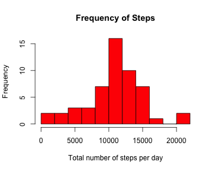
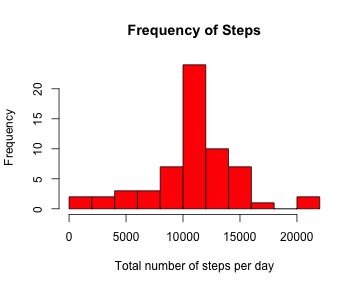
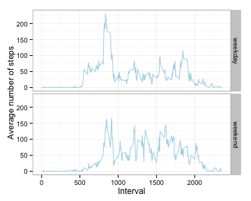

---
title: "Reproducible Research: Peer Assessment 1"
output: 
  html_document:
    keep_md: true
---

## Loading and preprocessing the data

```r
# Set working directory
setwd("/Users/priyankadochibhotla/Desktop/RepData_PeerAssessment1")

# Load the data
activity <- read.csv(unz("activity.zip", "activity.csv"), header=T, quote="\"", sep=",")
head(activity)
```

```
##   steps       date interval
## 1    NA 2012-10-01        0
## 2    NA 2012-10-01        5
## 3    NA 2012-10-01       10
## 4    NA 2012-10-01       15
## 5    NA 2012-10-01       20
## 6    NA 2012-10-01       25
```


## What is mean total number of steps taken per day?
* Calculate the total number of steps taken per day

```r
total_steps_per_day <- aggregate(steps ~ date, data = activity, sum, na.rm = TRUE)
head(total_steps_per_day)
```

```
##         date steps
## 1 2012-10-02   126
## 2 2012-10-03 11352
## 3 2012-10-04 12116
## 4 2012-10-05 13294
## 5 2012-10-06 15420
## 6 2012-10-07 11015
```

* Make a histogram of the total number of steps taken each day

```r
hist(total_steps_per_day$steps, xlab = "Total number of steps per day", ylab = "Frequency", main = "Frequency of Steps", col = "red", breaks = 10)
```



* Calculate and report the mean and median of the total number of steps taken per day

```r
mean(total_steps_per_day$steps)
```

```
## [1] 10766.19
```

```r
median(total_steps_per_day$steps)
```

```
## [1] 10765
```
The mean of the total number of steps taken per day is 10766.
The median of the total number of steps taken per day is 10765.


## What is the average daily activity pattern?
* Make a time series plot (i.e. type = "l") of the 5-minute interval (x-axis) and the average number of steps taken, averaged across all days (y-axis)

```r
mean_steps_per_interval <- aggregate(steps ~ interval, data = activity, mean, na.rm = TRUE)
plot(mean_steps_per_interval, type = "l", xlab = "Interval", ylab = "Average number of steps", main = "Average Steps vs. Interval")
```


* Which 5-minute interval, on average across all the days in the dataset, contains the maximum number of steps?

```r
mean_steps_per_interval[which.max(mean_steps_per_interval$steps), ]
```

```
##     interval    steps
## 104      835 206.1698
```
The 835th interval contains the maximum number of steps on average.


## Imputing missing values
* Calculate and report the total number of missing values in the dataset (i.e. the total number of rows with NAs)

```r
nrow(activity[is.na(activity$steps), ])
```

```
## [1] 2304
```
The total number of missing values in the dataset is 2304.

* Devise a strategy for filling in all of the missing values in the dataset. The strategy does not need to be sophisticated. For example, you could use the mean/median for that day, or the mean for that 5-minute interval, etc.
Missing values in the dataset are replaced by the mean for the corresponding interval.

* Create a new dataset that is equal to the original dataset but with the missing data filled in.

```r
activityFilled <- activity

for (i in 1:nrow(activityFilled)) {
    if (is.na(activityFilled[i, ]$steps)) {
        activityFilled[i, ]$steps <- mean_steps_per_interval[mean_steps_per_interval$interval ==
                                                             activityFilled[i, ]$interval, ]$steps
    }
}

head(activityFilled)
```

```
##       steps       date interval
## 1 1.7169811 2012-10-01        0
## 2 0.3396226 2012-10-01        5
## 3 0.1320755 2012-10-01       10
## 4 0.1509434 2012-10-01       15
## 5 0.0754717 2012-10-01       20
## 6 2.0943396 2012-10-01       25
```

* Make a histogram of the total number of steps taken each day

```r
new_total_steps <- aggregate(steps ~ date, data = activityFilled, sum, na.rm = TRUE)

hist(new_total_steps$steps, xlab = "Total number of steps per day", ylab = "Frequency", main = "Frequency of Steps", col = "red", breaks = 10)
```



* Calculate and report the mean and median total number of steps taken per day. Do these values differ from the estimates from the first part of the assignment? What is the impact of imputing missing data on the estimates of the total daily number of steps?

```r
mean(new_total_steps$steps)
```

```
## [1] 10766.19
```

```r
median(new_total_steps$steps)
```

```
## [1] 10766.19
```
The new mean of the total number of steps taken per day is unchanged, 10766 .
The new median of the total number of steps taken per day is now 10766.
Imputing missing data has no effect on the mean of the total daily number of steps. However, it does change, specifically increase, the median.


## Are there differences in activity patterns between weekdays and weekends?
* Create a new factor variable in the dataset with two levels – “weekday” and “weekend” indicating whether a given date is a weekday or weekend day.

```r
type_of_day <- function(date) {
    day <- weekdays(date)
    if (day %in% c("Monday", "Tuesday", "Wednesday", "Thursday", "Friday")) 
        return("weekday")
    else if (day %in% c("Saturday", "Sunday")) 
        return("weekend")
}

activityFilled$day <- sapply(as.Date(activityFilled$date), type_of_day)
head(activityFilled)
```

```
##       steps       date interval     day
## 1 1.7169811 2012-10-01        0 weekday
## 2 0.3396226 2012-10-01        5 weekday
## 3 0.1320755 2012-10-01       10 weekday
## 4 0.1509434 2012-10-01       15 weekday
## 5 0.0754717 2012-10-01       20 weekday
## 6 2.0943396 2012-10-01       25 weekday
```

* Make a panel plot containing a time series plot (i.e. type = "l") of the 5-minute interval (x-axis) and the average number of steps taken, averaged across all weekday days or weekend days (y-axis). See the README file in the GitHub repository to see an example of what this plot should look like using simulated data.

```r
mean_steps_per_weekday <- aggregate(steps ~ day + interval, data = activityFilled, mean, na.rm = TRUE)

ggplot(mean_steps_per_weekday, aes(interval, steps)) + geom_line(col = "lightblue") + facet_grid(day ~ .) + xlab("Interval") + ylab("Average number of steps")
```


